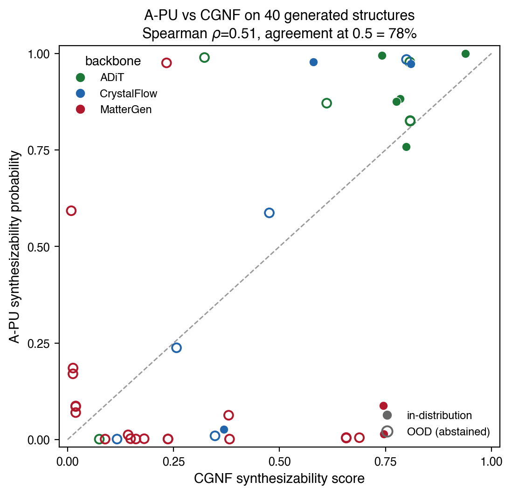
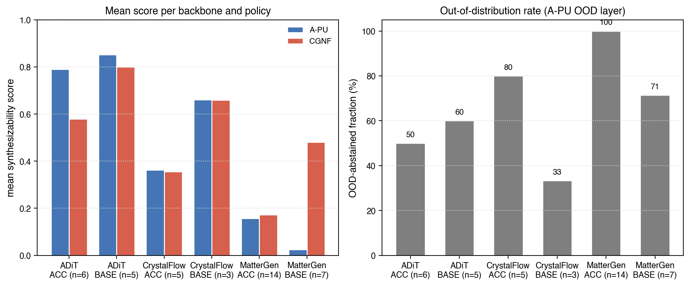

# ORB-PU Synthesizability: Findings (for paper addition)

_Status: working notes, 2026-05-29. Numbers are reproducible from
`results/apu/` (fixed-HP sweep) and `results/cgnf_compare/` (CGNF-matched
head-to-head) on Grace at `$SCRATCH/apu-synth-sweep`._

**Terminology.** The base scorer is **ORB-PU**: ORB-embedding features + Mordelet–Vert
positive-unlabeled bagging. The 20 fixed-HP runs below are plain ORB-PU bagging with
**no abstention**. **A-PU** (Abstaining PU) is reserved for the tuned variant that adds
an abstention/OOD/decision policy on top of the scorer (Optuna phase; see Next steps).
Do not label the fixed-HP runs "A-PU" — they have no abstention.

## Goal

Build an ORB-embedding positive-unlabeled (ORB-PU) synthesizability scorer for
inorganic compositions and compare it, on identical data and metrics, against the
pretrained composition-only CGNF model (Jang et al., *Matter* 2024).

## Data

Feature bank: **109,283** Materials Project entries — **49,283 labeled positives**
(experimentally reported) + **60,000 unlabeled**. Feature blocks: ORB-v3 mean-pooled
embedding reduced to 50 PCA components (`orb_pca`), Magpie composition descriptors
(`magpie`, 132-d), and an ORB-energy stability scalar (`stability`).

Split (stratified by label): train 76,498 / val 10,928 / **test 21,857** (9,857
positives + 12,000 unlabeled). Every model trains on train+val and is evaluated on
the held-out test split. This held-out-positives design matches CGNF's own
evaluation protocol (CGNF holds out 20% of known positives; our test positives are
≈20% of all positives).

## Evaluation protocol

CGNF does **not** use a thermodynamic (e_hull) or structural proxy for
synthesizability. Its evaluation, confirmed from the released code
(`Synthesizability-stoi-CGNF/data.py`), is a pure PU held-out protocol: recall on
held-out *known* positives (TPR), with the unlabeled pool as pseudo-negatives, plus
a class-prior-based estimated precision and a prior-adjusted decision threshold
(its 0.741, alongside 0.5). We therefore evaluate on the same basis and avoid any
e_hull proxy (which would conflate thermodynamic stability with synthesizability and
is partly circular, since ORB-energy stability is already an input feature).

Metrics (all on the test split, held-out positives = class 1, unlabeled = class 0):
**TPR@0.5** (recall on held-out positives); **pessimistic precision@0.5** (unlabeled
predicted-positive counted as false positives — a lower bound, since the unlabeled
pool hides true positives, but computed identically for every model so the
comparison is fair); **AUROC**, **AUPRC** (prior-free ranking); **ECE**
(calibration). β denotes the estimated positive fraction in the unlabeled pool from
each model (a "liberalness" indicator).

A class-prior *estimated precision* (Elkan–Noto) was also computed but **saturated at
1.0 for every model including CGNF**: our bagging balances positives against
pseudo-negatives, which inflates positive scores and breaks the calibration that
estimator assumes. It is therefore not reported. A proper mixture-proportion
estimator (KM2 / DEDPUL) would be required for a calibrated precision and is left as
an option.

## Result 1 — ORB-PU configuration sweep (fixed hyperparameters, no abstention)

20 configurations: {Magpie, ORB, ORB+Magpie, ORB+Magpie+stability} ×
{RandomForest, XGBoost, MLP, nnPU} (plus a few n_bags variants), Mordelet–Vert
PU bagging, **no abstention layer**. Top and bottom rows by AUPRC:

| config | arch | TPR | precision* | recall | F1 | AUPRC | AUROC | ECE |
|---|---|---|---|---|---|---|---|---|
| ORB+Magpie | xgboost | 0.896 | 0.837 | 0.896 | 0.866 | **0.946** | 0.953 | 0.036 |
| ORB+Magpie+stab | xgboost | 0.897 | 0.838 | 0.897 | 0.867 | 0.946 | 0.953 | 0.036 |
| ORB+Magpie | rf | 0.914 | 0.851 | 0.914 | 0.881 | 0.943 | 0.956 | 0.049 |
| ORB+Magpie+stab | rf | 0.914 | 0.851 | 0.914 | 0.881 | 0.943 | 0.957 | 0.049 |
| ORB | mlp | 0.901 | 0.843 | 0.901 | — | 0.931 | 0.950 | 0.015 |
| Magpie | xgboost | 0.878 | 0.825 | 0.878 | 0.851 | 0.936 | 0.943 | 0.031 |
| Magpie | nnpu | 0.724 | 0.740 | 0.724 | 0.732 | 0.758 | 0.823 | 0.191 |
| ORB | nnpu | 0.718 | 0.748 | 0.718 | 0.733 | 0.772 | 0.830 | 0.160 |

\*pessimistic precision@0.5.

Observations: the feature set has a larger effect than the architecture; ORB+Magpie
is the strongest feature combination; the ORB-energy `stability` block changes the
metrics by less than 0.002 (rows 1 vs 2); nnPU is the weakest family and the least
well calibrated. XGBoost and RandomForest are within ~0.003 AUPRC of each other
(XGBoost slightly higher AUPRC, RandomForest slightly higher AUROC/TPR).

## Result 2 — CGNF-matched head-to-head (same test split, same metrics)

Pretrained CGNF scored on the identical 9,857-positive + 12,000-unlabeled test split
(0 formulas dropped — full element coverage):

| model | TPR@.5 | pessPrec | AUPRC | AUROC | ECE | β |
|---|---|---|---|---|---|---|
| **CGNF (pretrained)** | **0.973** | 0.574 | 0.805 | 0.853 | 0.241 | 0.623 |
| ORB-PU ORB+Magpie · xgboost | 0.896 | 0.837 | **0.946** | 0.953 | 0.036 | 0.244 |
| ORB-PU ORB+Magpie · rf | 0.914 | 0.851 | 0.943 | 0.956 | 0.049 | 0.239 |

On this MP test split, CGNF has the highest recall (0.973) but assigns a positive
score to a large fraction of the unlabeled pool (β=0.623), which gives a lower
precision (0.574), lower ranking metrics (AUPRC 0.805, AUROC 0.853), and a higher
calibration error (ECE 0.241). The ORB-PU ORB+Magpie models have higher ranking
metrics and lower calibration error on the same data (AUPRC ≈0.945, AUROC ≈0.955,
ECE ≈0.04).

For reference, CGNF reports on **its own** dataset: TPR 83.4%, estimated precision
83.6% (thresholds 0.5 and 0.741).

## Important caveat (do not over-read Result 2)

This test-split comparison favors the ORB-PU model **by construction** and should not
be reported as a clean "ORB-PU > CGNF":

1. **In-distribution vs zero-shot.** ORB-PU is trained on this MP positive/unlabeled
   distribution and evaluated on a held-out split of it; CGNF is trained on a
   different (ICSD-based) dataset and scored zero-shot on MP data. An in-distribution
   model outperforming a zero-shot one on its home distribution is expected.
2. **Possible positive overlap.** If our held-out positives overlap CGNF's ICSD
   training positives, CGNF's 0.973 TPR is partly memorization.

The defensible reading is narrower: **CGNF is liberal and miscalibrated on MP-style
compositions**, whereas the ORB-PU scorer is well-ranked and well-calibrated on the
same data. The genuinely fair method comparison is on the **generated diffusion
structures**, where both scorers are out-of-distribution; that comparison is the one
intended for the paper.

## Result 3 — Optuna-tuned A-PU

Eight studies were run, one per (feature set × base learner) for feature sets
{Magpie, ORB, ORB+Magpie, ORB+Magpie+stability} and base learners {RandomForest,
XGBoost}. Each study used a TPE sampler (seed 42), a median pruner, and 5-fold
stratified inner cross-validation, maximizing AUPRC on the held-out positive-vs-
unlabeled split. nnPU was excluded because it was the weakest family in the
fixed-HP sweep. The abstention/OOD/decision policy is applied after tuning: AUPRC
is invariant to the abstain decision, so a ranking objective cannot tune the
abstention thresholds. The thresholds therefore use the notebook defaults
(confidence 0.15, disagreement 0.25, OOD 1.0); the OOD threshold is intrinsically
referenced to the 95th percentile of positive-training distances. Coverage
(1 − abstain rate) on the in-distribution test split is reported alongside.

| feature set | base | CV AUPRC | test AUPRC | test AUROC | TPR | ECE | coverage |
|---|---|---|---|---|---|---|---|
| ORB+Magpie | XGBoost | 0.956 | 0.961 | 0.967 | 0.892 | 0.024 | 0.72 |
| ORB+Magpie+stab | XGBoost | 0.955 | 0.960 | 0.966 | 0.891 | 0.010 | 0.71 |
| Magpie | XGBoost | 0.948 | 0.949 | 0.956 | 0.872 | 0.007 | 0.72 |
| ORB+Magpie | RandomForest | 0.941 | 0.945 | 0.956 | 0.892 | 0.054 | 0.65 |
| ORB+Magpie+stab | RandomForest | 0.941 | 0.944 | 0.956 | 0.893 | 0.053 | 0.66 |
| Magpie | RandomForest | 0.935 | 0.937 | 0.948 | 0.875 | 0.033 | 0.68 |
| ORB | XGBoost | 0.919 | 0.929 | 0.948 | 0.873 | 0.034 | 0.71 |
| ORB | RandomForest | 0.904 | 0.912 | 0.936 | 0.861 | 0.082 | 0.60 |

The selected model is ORB+Magpie XGBoost (best parameters: n_bags 19,
neg_sample_ratio 1.29, n_estimators 300, max_depth 9, learning_rate 0.169,
subsample 0.999, colsample_bytree 0.637, reg_alpha 0.592, reg_lambda 1.476).
Relative to the corresponding fixed-HP configuration, tuning produced small
improvements on this in-distribution split: AUPRC 0.946 → 0.961, AUROC 0.953 →
0.967, ECE 0.036 → 0.024. The ordering observed in the fixed-HP sweep is preserved:
XGBoost is ahead of RandomForest after tuning, ORB+Magpie is the strongest feature
combination, the ORB-energy stability block changes the metrics by less than 0.002,
and composition-only Magpie remains competitive.

## Result 4 — Generated-structure head-to-head (A-PU vs CGNF)

The tuned ORB+Magpie XGBoost A-PU model and pretrained CGNF were applied to 40
generated structures (backbones ADiT, CrystalFlow, MatterGen; policies BASE and
ACC). On these structures both scorers are out-of-distribution, so this is the
comparison on equal footing, in contrast to the MP test split of Result 2. CGNF
returned a score for all 40 (no element fell outside its embedding). Structures
were featurized with the same pipeline as the bank (single-pass ORB embedding, the
bank's fitted PCA, and Magpie).

Rank agreement between the two scorers is moderate: Spearman ρ = 0.51 over the 40
structures, with 77.5% agreement on the 0.5 decision gate. The A-PU model's
out-of-distribution criterion flags 30 of 40 structures (75%); the abstentions are
almost entirely OOD-driven rather than low-confidence or high-disagreement.

Per (backbone, policy) mean scores and OOD rates are shown in
`analysis/synth_figures/fig_per_backbone_panel.png`, and the per-structure
relationship in `analysis/synth_figures/fig_apu_vs_cgnf_scatter.png`.

| backbone | policy | n | A-PU mean | CGNF mean | OOD rate |
|---|---|---|---|---|---|
| ADiT | BASE | 5 | 0.85 | 0.80 | 0.60 |
| ADiT | ACC | 6 | 0.79 | 0.58 | 0.50 |
| CrystalFlow | BASE | 3 | 0.66 | 0.66 | 0.33 |
| CrystalFlow | ACC | 5 | 0.36 | 0.36 | 0.80 |
| MatterGen | BASE | 7 | 0.03 | 0.48 | 0.71 |
| MatterGen | ACC | 14 | 0.16 | 0.17 | 1.00 |

The two scorers agree on conventional main-group chemistries (for example Na2BO3
at 0.999/0.94, Li3PO4 at 0.76/0.80, TaB2W at 0.99/0.74). They differ on lithium–
magnesium binaries (Li4Mg, Li5Mg3, Li7Mg3, LiMg: A-PU near 0.001–0.005 and OOD-
flagged, CGNF 0.16–0.69) and on several heavy intermetallics (for example Os5W3:
A-PU 0.59, CGNF 0.009). Because 75% of the set is flagged out-of-distribution by
the A-PU model, the absolute scores on generated structures are extrapolative for
both methods and should be interpreted with that in mind; the per-backbone OOD rate
is itself a measure of how far each generator's outputs sit from the MP training
distribution (lowest for ADiT and CrystalFlow-BASE, highest for MatterGen).

## Artifacts and reproducibility

All result files (metrics JSON, Optuna `trials.csv` and `best_params.json`,
`test_panel.json`, generated-structure `scores.csv` and summary) and the figures
are committed under `results/apu_grace/` and `analysis/synth_figures/`. Model
checkpoints (`results/apu_optuna/<config>/model.joblib`, 70 MB–1.5 GB each, 3.6 GB
total) exceed the GitHub 100 MB per-file limit and are therefore not committed;
they are retained on Grace at
`$SCRATCH/apu-synth-sweep/results/apu_optuna/` and mirrored locally under
`results/apu_grace/`. Each study is reproducible from `slurm/apu_optuna.slurm`
(seed 42) against the cached feature bank.
